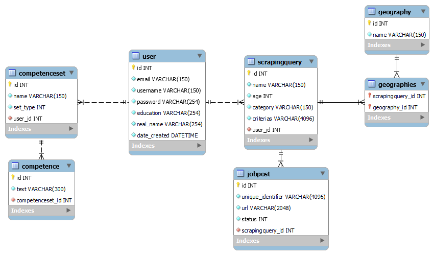

# Welcome to my automatic cover letter app!

I created this project to automate the process of applying for jobs.
The app lets an user automate the job process by letting them scrape jobsites based on filters that they can create.
It also lets users automatically create cover letters from simple skill and motivation descriptions combined with a job description. (using open AI gpt model)
The cover letter returned by the application is in English as well as a language specified by the user.

ERD diagram:  

If you are interested in the project, please let me know, as I may continue development then.

Best regards 

Benjamin
